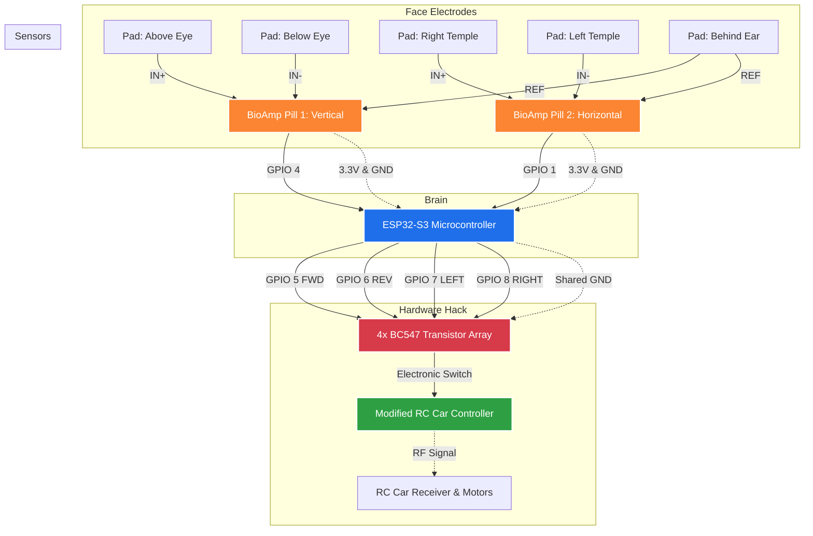

# 🚗🧠 NeuroX: Dual-Channel BCI Robotics System

**NeuroX** is a non-invasive, real-time Brain-Computer Interface (BCI) robotics platform. It removes the need for physical controllers by utilizing dual-channel biological signal processing. By capturing Electrooculography (EOG) and Electromyography (EMG) data, NeuroX translates human eye movements and jaw muscle contractions into instantaneous motor commands.

## 🕹️ Control Matrix
NeuroX operates on a pure biological signal mapping system. The operator keeps their head stationary and uses eye/muscle movements to drive:

*   🟢 **FORWARD:** Single Blink *(Positive vertical EOG spike)*
*   🔴 **REVERSE:** Downward Saccade / Look Down *(Negative vertical EOG spike)*
*   ⬅️ **LEFT:** Left Saccade / Glance Left *(Negative horizontal EOG spike)*
*   ➡️ **RIGHT:** Right Saccade / Glance Right *(Positive horizontal EOG spike)*
*   🛑 **EMERGENCY STOP:** Jaw Clench *(High-frequency EMG burst)*

## ⚙️ Hardware Architecture & Wiring Diagram
*   **Microcontroller:** ESP32-S3 (Operating at a rigid 256 Hz sample rate)
*   **Biopotential Amplifiers:** 2x BioAmp EXG Pills (Upside Down Labs)
*   **Actuation:** Custom modified RC remote using an array of 4x BC547 NPN transistors to electronically trigger the controller's PCB contacts.
*   **Interface:** Standard Ag/AgCl medical gel electrodes

## 🧠 DSP Pipeline & Algorithmic Design
Processing raw biological signals on a microcontroller without latency or false-positive crosstalk requires an advanced Digital Signal Processing (DSP) pipeline. The NeuroX v6 firmware features:
1.  **50Hz Notch Filter:** Eliminates AC mains power line interference.
2.  **Median-5 Despiker:** Strips out hardware impulses and random electrical artifacts.
3.  **Custom Biquad Bandpass Filtering:**
    *   `CH1 (Vertical):` Tuned for blinks and vertical saccades.
    *   `CH2 (Horizontal):` Custom **0.3 Hz - 10 Hz** bandpass specifically engineered to capture slow horizontal eye movements, preserving 27% more signal amplitude than standard BCI filters.
4.  **EMG Envelope Detection:** Utilizes a 15 Hz high-pass filter fed into a moving average envelope to isolate jaw muscle (masseter) flexes.
5.  **Comparative Veto Logic:** A custom algorithm that prevents channel crosstalk. It mathematically compares the amplitude of CH1 and CH2 in real-time, preventing the car from turning left/right when the user is simply blinking.

## 🧑‍⚕️ Electrode Montage (5-Pad Setup)
Accurate placement is critical to avoid ground loops and signal degradation. Both EXG sensors share a common reference.

*   **CH1 (Vertical - GPIO 4):**
    *   `IN+` : 2 cm directly above the center of one eye.
    *   `IN-` : 2 cm directly below the same eye (cheekbone).
*   **CH2 (Horizontal - GPIO 1):**
    *   `IN+` : Right temple (outer canthus of the right eye).
    *   `IN-` : Left temple (outer canthus of the left eye).
*   **REF (Common Ground):**
    *   Snap BOTH reference wires to a **single** electrode placed on the mastoid bone (behind either ear).

## 🚀 Setup & Calibration
1. Flash `NeuroX_FinalCode_V6.ino` to the ESP32-S3.
2. Open the Arduino IDE **Serial Plotter** at `115200` baud.
3. Observe the baseline signals. Every user has different muscle density and biopotential resting states.
4. Adjust the threshold constants (`BLINK_THRESHOLD`, `LOOK_DOWN_THRESHOLD`, `HORZ_THRESHOLD`) in the firmware to calibrate the system to the specific operator.
